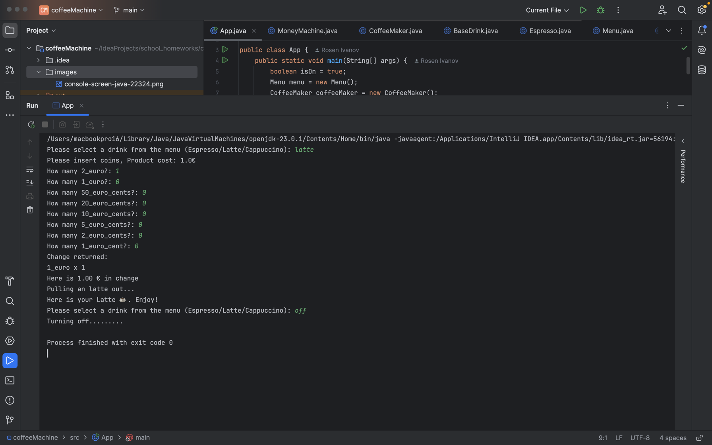

# Проект: Мини „Кафе машина“ (Coffee Machine System)

## Описание

Проектът „Кафе машина“ представлява конзолна Java система, която симулира работа на автомат за кафе.
Потребителят може да избере напитка от меню, да плати с монети, да получи ресто и да получи приготвена напитка при наличие на достатъчно ресурси.

Проектът има за цел да демонстрира добри обектно-ориентирани практики и работа със стандартните Java колекции.

---

## Структура на проекта
```
src
├── App.java
├── BaseDrink.java
├── Espresso.java
├── Latte.java
├── Cappuccino.java
├── Menu.java
├── CoffeeMaker.java
├── MoneyMachine.java
└── README.md
```

---

## Компилация и изпълнение
### Компилация на всички Java класове в текущата директория
```bash
javac *.java
```
### Подкарване на основния App клас
```bash
java App.java
```

---

### Примерен изход на програмата (По - долу може да се намери скрийншот с примерния изход)
```
Please select a drink from the menu (Espresso/Latte/Cappuccino): latte
Please insert coins, Product cost: 1.0€
How many 2_euro?: 1
How many 1_euro?: 0
How many 50_euro_cents?: 0
How many 20_euro_cents?: 0
How many 10_euro_cents?: 0
How many 5_euro_cents?: 0
How many 2_euro_cents?: 0
How many 1_euro_cent?: 0
Change returned:
1_euro x 1
Here is 1.00 € in change
Pulling an latte out...
Here is your Latte ☕️. Enjoy!
Please select a drink from the menu (Espresso/Latte/Cappuccino): off
Turning off.........
```

---
### Класове използвани за направата на задачата
### App
Главен клас, съдържащ `main()` метода и основния цикъл на програмата.

Отговорности: 
-  Чете вход от потребителя
-  Управлява командите `off` и `report`
-  Свързва основните компоненти на системата

### BaseDrink (абстрактен клас)

Абстрактен клас, представящ напитка.

Членове:

-  `String name`

-  `double cost`

-  `HashMap<String, Integer> ingredients`

Методи:

-  `getters / setters`

- `prepare()`

### Espresso / Latte / Cappuccino

Конкретни класове, наследяващи BaseDrink.

Характеристики:

-  Дефинират собствени съставки чрез HashMap

-  Имплементират метода `prepare()`

### Menu

Клас, съдържащ всички налични напитки.

Членове:

-  `ArrayList<BaseDrink> menuItems`

Методи:

-  `getAllItemsNames()`

-  `findItem(String name)`

### CoffeeMaker

Отговаря за наличните ресурси и приготвянето на напитки.

Членове:

-  `HashMap<String, Integer> availability`

Методи:

- `refillMachine()`

- `coffeeMachineReport()`

- `areResourcesSufficient(BaseDrink drink)`

- `makeCoffee(BaseDrink drink)`

### MoneyMachine

Отговаря за плащанията и връщането на ресто.

Членове:

-  `HashMap<String, Double> euroCents`

-  `double profit`

Методи:

-  `makePayment(double cost, Scanner scanner)`

- `moneyMachineReport()`

---

### Използвани концепции

-  Капсулация

-  Наследяване

-  Абстракция

-  Полиморфизъм

-  Работа с `HashMap`

-  Валидация на потребителски вход

---

### Екранна снимка на изхода посочен по - горе


---

### Автор

-  Име: `Росен Иванов`

-  Проект: `Coffee Machine (Java)`

- Учител - `доц. Явор Томов`

-  Курс: `Обектно-ориентирано програмиране с Java`
